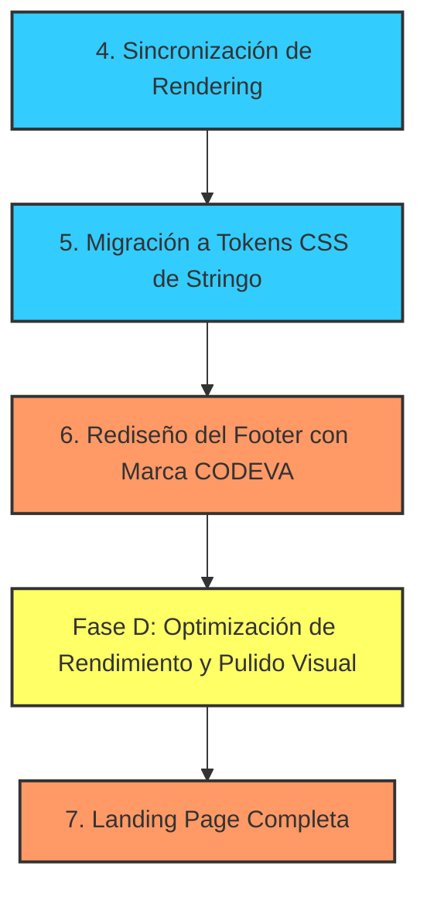

# 📝 TO-DO: Plan de Cierre y Optimización — HáceloArt

Este documento consolida el **Backlog de Arreglos** y las recomendaciones de la **Auditoría de Calidad** en una lista de tareas ordenadas, priorizadas y listas para ejecutar, adaptadas a la identidad de marca de **Stringo** y sumando la marca de **CODEVA** en el pie de página.

---

## 📅 Roadmap de Tareas Pendientes

---

## 🎨 Guía de Estilos de Marca (Stringo)
*Extraídos directamente del sitio oficial https://www.stringo.ar/*

- **Paleta de Colores**:
  - `Color Primario (Acentos)`: `#2A3D47` (Charcoal azulado elegante, usado en botones de acción y fondos de estado activo).
  - `Color Secundario`: `#A0BADA` (Celeste/azul pastel suave para elementos secundarios y sutiles).
  - `Fondo General (Light)`: `#FFFFFF`
  - `Fondo Secundario / Cards`: `#F5F5F5`
  - `Texto Principal`: `#161616` (Gris carbón oscuro).
  - `Texto en Botones Sólidos`: `#FFFFFF`
- **Tipografía**:
  - `Encabezados (Headings)`: `Halant, serif` (Aspecto editorial y orgánico).
  - `Cuerpo de Texto`: `Muli, sans-serif` / `Mulish` (Geométrica, moderna y de alta legibilidad).
- **Componentes**:
  - `Radio de Borde de Botones`: `14px`
  - `Radio de Borde de Tarjetas/Paneles`: `12px` (1.2rem)

---

## 🔴 Fase A: Estabilización Visual y UX (Prioridad Alta)
*Estas tareas corrigen inconsistencias y eliminan el aspecto "borrador" de la aplicación actual.*

- [x] **Reemplazo de Emojis por Iconos SVG Profesionales**
- [x] **Bloquear Parámetro de Pines a 240 (Fidelidad del Kit Físico)**

---

## 🟡 Fase B: Refactorización y Consistencia de Código (Prioridad Media)
*Mejora la mantenibilidad del código y la velocidad de renderizado en dispositivos móviles.*

- [x] **Atomización de la Pantalla del Modo Guiado (`guide-page.tsx`)**
- [x] **Sincronización del Renderizado del Canvas (Fidelidad Visual)**
- [x] **Migración Completa a CSS Variables de Stringo (Design Tokens)**
- [x] **Rediseño del Footer con la Marca de CODEVA (SVG)**
- [ ] **Rediseño Comercial de la Landing Page (`/`)**

---

## ⚡ Fase D: Optimización de Rendimiento, Mobile-First y Pulido Visual (Prioridad Alta)
*Optimizaciones táctiles avanzadas, aceleración de GPU en renderizado en tiempo real y pulido de marca.*

### 1. Filtros CSS y Rendimiento en Tiempo Real (Aceleración por GPU)
- [x] **Visualización a 60 FPS:** Mapear los deslizadores de ajustes tonales y los gestos táctiles a propiedades de filtro CSS (`ctx.filter` y CSS variables de filtro) para refrescar el canvas de visualización en tiempo real durante el arrastre de los dedos o cursores.
- [x] **Debounce de Procesamiento Pesado:** Ejecutar el procesamiento pesado (`processImage` con binarización, cálculo de errorMap y nitidez) únicamente mediante un debounce optimizado al finalizar el gesto/deslizamiento (`onTouchEnd`, `onChangeEnd`), evitando congelamiento de la CPU.

### 2. Ajustes Adaptativos y Responsivos (Mobile vs Desktop)
- [x] **Ocultar Flechas en Escritorio:** Configurar `@media (min-width: 768px)` en los estilos del modo guiado para que las flechas de deslizamiento (`swipeHintLeft` y `swipeHintRight`) no se muestren cuando se use mouse/teclado.
- [x] **Ocultar Sliders Redundantes en Celular:** Ocultar los controles manuales de Zoom y Posición (X/Y) en dispositivos móviles, ya que el encuadre se realiza directamente de forma gestual con dos dedos sobre el canvas.

### 3. Efectos Visuales y Consistencia de Marca
- [x] **Efecto de Desenfoque Exterior (Crop Mask Blur):** Aplicar una máscara de desenfoque (`backdrop-filter: blur(4px)`) a los bordes de la imagen cargada que queden fuera del círculo del bastidor, destacando la zona activa de tejido.
- [x] **Marca de Agua en el Lienzo Vacío:** Agregar el logotipo de Stringo (`public/stringo-logo.png`) como una marca de agua difusa/atenuada (opacidad ~0.15 y escala de grises) en el centro del canvas cuando no hay imagen cargada.
- [x] **Link e Interacción en el Pie de Página:** Envolver el logo de Codeva en el footer en un enlace directo a `www.codeva.com.ar` y remover la rotación de 5 grados del hover, cambiándola por una escala limpia y moderna de `1.08`.

### 4. Flujo de Estados del Editor (Lock de Ajustes)
- [x] **Bloqueo Post-Generación:** Ocultar/bloquear el panel de ajustes de imagen una vez generada la secuencia para evitar que el usuario asuma que los cambios tonales se reflejan en la secuencia en tiempo real.
- [x] **Botón "Volver a editar imagen":** Mostrar un botón claro tras la generación que restablezca el estado del canvas y permita reconfigurar y recalcular la secuencia.

### 5. Mejoras de Carga y Onboarding (Wow Factor)
- [x] **Área de Carga Premium (Dropzone):** Decidido mantener el botón de carga simple original por usabilidad en celulares.
- [x] **Tooltip Gestual de Zoom:** Mostrar un tooltip informativo flotante sobre el canvas la primera vez que se sube una imagen indicando cómo usar los dos dedos para re-encuadrar.
- [ ] **Animación de Trazado de Hilo:** Diseñar una animación de trazado de hilo dorada en la landing page de bienvenida para crear una primera impresión impactante. (Pospuesto junto al rediseño comercial de la landing page).

---

## ⏸️ Fase C: Integración y Audio Premium (Diferido / Stand-by)
*Estas tareas quedan en pausa hasta que el cliente defina los detalles técnicos y comerciales.*

- [ ] **Integración con Google Cloud TTS** (Voz premium Neural2 y fallback nativo).
- [ ] **Módulo de Autenticación Shopify** (Middleware de validación de compra y cookies JWT).
