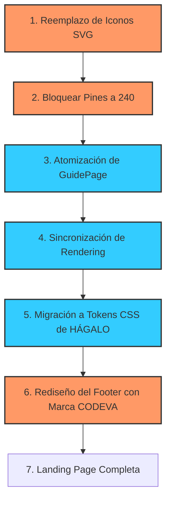

# 📝 TO-DO: Plan de Cierre y Optimización — HáceloArt

Este documento consolida el **Backlog de Arreglos** y las recomendaciones de la **Auditoría de Calidad** en una lista de tareas ordenadas, priorizadas y listas para ejecutar, adaptadas a la identidad de marca de **HÁGALO** y sumando la marca de **CODEVA** en el pie de página.

---

## 📅 Roadmap de Tareas Pendientes

---

## 🎨 Guía de Estilos de Marca (HÁGALO)
*Extraídos directamente del sitio oficial https://www.hagalo.com.ar/*

- **Paleta de Colores**:
  - `Color Primario (Acentos)`: `#2A3D47` (Charcoal azulado elegante, usado en botones de acción y fondos de estado activo).
  - `Color Secundario`: `#A0BADA` (Celeste/azul pastel suave para elementos secundarios y sutiles).
  - `Fondo General (Light)`: `#FFFFFF`
  - `Fondo Secundario / Cards`: `#F5F5F5`
  - `Texto Principal`: `#161616` (Gris carbón oscuro).
  - `Texto en Botones Sólidos`: `#FFFFFF`
- **Tipografía**:
  - `Encabezados (Headings)`: `Halant, serif` (Aspecto editorial y orgánico).
  - `Cuerpo de Texto`: `Muli, sans-serif` / `Mulish` (Geométrica, moderna y de alta legibilidad).
- **Componentes**:
  - `Radio de Borde de Botones`: `14px`
  - `Radio de Borde de Tarjetas/Paneles`: `12px` (1.2rem)

---

## 🔴 Fase A: Estabilización Visual y UX (Prioridad Alta)
*Estas tareas corrigen inconsistencias y eliminan el aspecto "borrador" de la aplicación actual.*

### 1. Reemplazo de Emojis por Iconos SVG Profesionales
- [x] **Volver al Editor** (`guide-page.tsx`): Reemplazar `⬅️` por un SVG de flecha a la izquierda (`ArrowLeft`).
- [x] **Toggle de Audio** (`guide-page.tsx`): Reemplazar `🔊` y `🔇` por SVGs limpios de altavoz activo/mutado (`Volume2` y `VolumeX`).
- [x] **Botones de Navegación** (`guide-page.tsx`): Reemplazar `◀️` y `▶️` por chevrons vectoriales (`ChevronLeft` / `ChevronRight`).
- [x] **Autoplay** (`guide-page.tsx`): Reemplazar los botones inline de reproducción por iconos SVG profesionales de `Play` y `Pause`.
- [x] **Modales de Control** (`guide-page.tsx`):
  - [x] Reemplazar el icono de previsualización `👁️` por un SVG de ojo (`Eye`).
  - [x] Reemplazar el icono de secuencia `📋` por un SVG de lista/portapapeles (`List` / `Clipboard`).
- [x] **Indicador de Wake Lock** (`guide-page.tsx`): Reemplazar `🟢` / `🔴` por un indicador de estado elegante (ej. un círculo estilizado con pulsación CSS o un icono de candado/pantalla activa).
- [x] **Celebración de Fin** (`guide-page.tsx`): Cambiar `🎉` por un diseño SVG festivo premium (como destellos u trofeo en dorado).

### 2. Bloquear Parámetro de Pines a 240 (Fidelidad del Kit Físico)
- [x] **Remover Slider de Pines** (`config-panel.tsx`): El kit de HÁGALO cuenta con 240 pines fijos en el tablero de 50 cm. Cambiar el control deslizable por un campo de texto informativo (o remover el slider y pasar el valor fijo internamente) para evitar que el usuario genere secuencias no realizables físicamente.
- [x] **Centralizar KitSpec**: Asegurar que `totalPins: 240` sea inmutable y provenga de `src/core/kit-spec.ts`.

---

## 🟡 Fase B: Refactorización y Consistencia de Código (Prioridad Media)
*Mejora la mantenibilidad del código y la velocidad de renderizado en dispositivos móviles.*

### 3. Atomización de la Pantalla del Modo Guiado (`guide-page.tsx`)
- [x] **Extraer Componentes**: Reducir el archivo actual de 450+ líneas separándolo en submódulos dentro de `src/components/guide/`:
  - [x] `GuideHeader.tsx` (con navegación, título y selector de idioma).
  - [x] `ProgressBar.tsx` (barra de progreso y paso actual).
  - [x] `PinDisplay.tsx` (zona central táctil con los pines de origen y destino).
  - [x] `GuideControls.tsx` (botones de navegación y autoplay).
  - [x] `VisualizerModal.tsx` (modal con el canvas de progreso de hilos).
  - [x] `SequenceListModal.tsx` (modal con el listado completo indexado).

### 4. Sincronización del Renderizado del Canvas (Fidelidad Visual)
- [x] **Unificar Rendering en Editor y Guía**:
  - Actualmente, el Editor dibuja hilos con grosor `1.0` y opacidad `0.15` en `canvas-renderer.tsx`. (Nota: tras validación del usuario, se decidió mantener la fidelidad y opacidad 0.35 del Editor).
  - El visualizador de la guía dibuja con grosor `0.3` y opacidad `0.09` en `guide-page.tsx`.
  - **Acción**: Sincronizar ambos renderizadores para que el resultado en pantalla sea idéntico y represente fielmente el tejido real (se adoptaron los valores del Editor: grosor `1.0` y opacidad `0.35` con negro puro).

### 5. Migración Completa a CSS Variables de HÁGALO (Design Tokens)
- [x] **Implementar Tokens en CSS**: Modificar `design-tokens.css` para incorporar las variables y fuentes oficiales de HÁGALO.
- [x] **Reemplazar Colores Hardcodeados**: Adaptar `editor.module.css` y `guide.module.css` para utilizar estos tokens (`var(--color-primary)`, `var(--color-bg)`, etc.), asegurando un acabado estético que combine la sobriedad premium de la web del cliente.

### 6. Rediseño del Footer con la Marca de CODEVA (SVG)
- [x] **Integrar Logotipo Vectorial**: Modificar el componente `AppFooter.tsx` e incrustar de forma elegante y optimizada el logotipo SVG de **CODEVA** (`Isologotipo_Codeva 36_SVG.svg` con su característico color `#ca5435`).
- [x] **Estilos y Layout**: Realizar ajustes CSS (`app-footer.module.css`) para que el logotipo de Codeva quede perfectamente alineado y escalado (discreto, moderno y con buena accesibilidad visual).

### 7. Rediseño Comercial de la Landing Page (`/`)
- [ ] **Diseño Branded**: Crear una página de bienvenida que reemplace el placeholder actual utilizando la nueva guía de estilos. Debe incluir explicación visual del producto, pasos simplificados de uso y un botón premium animado para acceder al editor.

---

## ⏸️ Fase C: Integración y Audio Premium (Diferido / Stand-by)
*Estas tareas quedan en pausa hasta que el cliente defina los detalles técnicos y comerciales.*

- **Integración con Google Cloud TTS** (Voz premium Neural2 y fallback nativo).
- **Módulo de Autenticación Shopify** (Middleware de validación de compra y cookies JWT).
